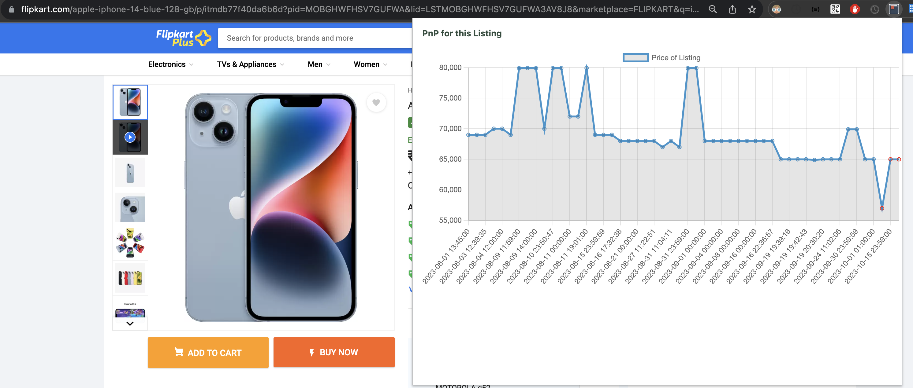
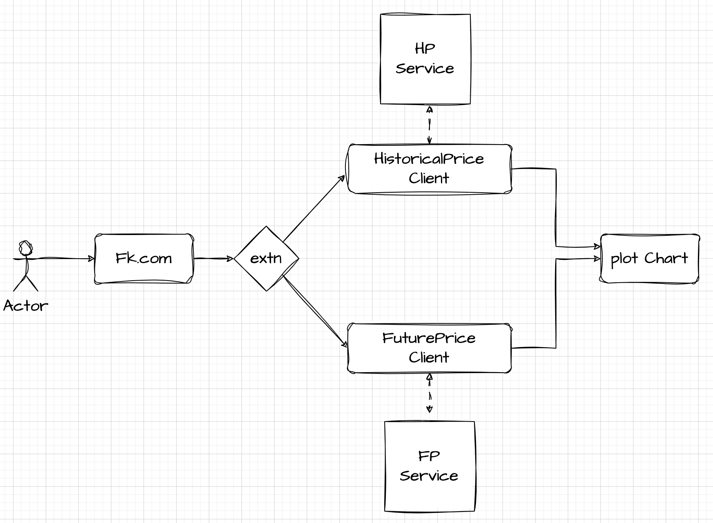

# Get Historical and Future Price for the given Product Page
  
- This is extension to fetch future price from the fk services.
- For any legal issues the API and URI are removed.

### Files and their usage.

- background.js
    - this is empty.
    - Use: this file runs like a cron.
- ContentScript.js
    - this is empty as we are not loading anything based on user action.
- popup.js
    - has a listener which is executed when the popup.html is loaded.

- Config.js
    - has all the configs
    - has the chart.min.js from [here] (https://www.jsdelivr.com/package/npm/chart.js?path=dist)
- model
    - Request.js
    - Response.js
- client
    - This has all the client to fetch the data
    - Step1: fetches Request body and Header from the Request.js
    - Step2: Call the util method: getAPIResponse/getPostAPIResponse.
    - Parse the response to fetch pricePoints.
- assets

- Sequence of call
    - extensionIconClick -> popup.html -> popup.js -> eventListener() -> getTimePoints() -> callHps(), CallRtg -> adaptTimelineToChartData() -> loadChart()
    - here is the HLD
        - 

##### Bibliography
- https://www.youtube.com/watch?v=0n809nd4Zu4&t=3114s&ab_channel=freeCodeCamp.org
- https://github.com/raman-at-pieces/youtube-bookmarker-starter-code
- https://www.chartjs.org/docs/latest/

